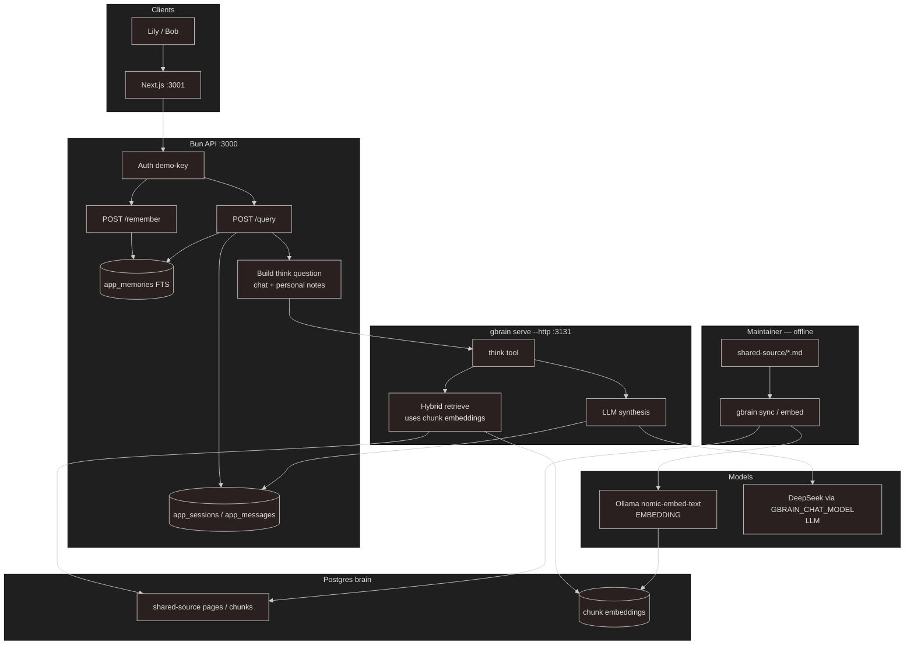

# gbrain-sandbox

Turborepo monorepo: Bun HTTP API (`apps/api`) with **shared knowledge in gbrain** and **personal memory in app Postgres**, plus a minimal Next.js UI (`apps/web`). No per-user git repos or per-user gbrain sources.

## Layout

```
gbrain-sandbox/
├── apps/
│   ├── api/                # Bun HTTP API (@gbrain-sandbox/api) :3000
│   └── web/                # Next.js UI (@gbrain-sandbox/web) :3001
├── packages/
│   └── typescript-config/  # Shared TSConfig
├── shared-source/          # Maintainer knowledge → one gbrain source (repo root)
├── docs/API.md             # Bun HTTP API contract
├── .env                    # gbrain + apps (see .env.example)
├── turbo.json
└── assets/                 # Images (optional)
```

Only `shared-source/` is a nested git repo (required by `gbrain sync`). Personal memory does **not** use git or gbrain sources. Keep `shared-source/` and `.env` at the **repo root** so project-scoped gbrain resolves them.

## Architecture

| Layer            | Storage                 | Scope                         | Git?                  |
| ---------------- | ----------------------- | ----------------------------- | --------------------- |
| Shared knowledge | gbrain `shared-source`  | Everyone                      | Yes (maintainer sync) |
| Personal memory  | Postgres `app_memories` | Owner only (`user_id` filter) | No                    |
| Chat turns       | Postgres `app_messages` | Per user (Bun)                | No                    |



| Path                           | Embedding (Ollama)                                            | LLM (DeepSeek)                                 |
| ------------------------------ | ------------------------------------------------------------- | ---------------------------------------------- |
| Maintainer `sync` / `embed`    | Yes — embed shared chunks into the brain                      | No                                             |
| `POST /query` → gbrain `think` | Yes — retrieve shared chunks by embedding (+ hybrid)          | Yes — synthesize the answer                    |
| `POST /remember`               | No — row in `app_memories` only                               | No                                             |
| Personal notes on query        | No — Postgres FTS, then text injected into the think question | Indirect — LLM sees them as part of the prompt |

**Query:** load chat history + this user's `app_memories` → call gbrain `think` (shared corpus) with personal memory injected into the question → store turn.

**Remember:** insert into `app_memories` for `user_id` only.

**New user:** insert `app_users` row → ready. No `sources add`, no `git init`, no OAuth client per user.

At scale, user count grows **rows** in `app_memories`, not filesystem repos or gbrain sources. Isolation is a hard `user_id` filter. One app-level OAuth client calls gbrain `think`.

## Prerequisites

- Postgres (`GBRAIN_DATABASE_URL`)
- `gbrain`, `bun`, Ollama (`nomic-embed-text`), DeepSeek API key
- `gbrain serve --http` on port **3131**

## Gbrain: project vs global

gbrain can run **globally** (`~/.gbrain`) or **per project** (`.env` + sources in a repo). This sandbox is **project-scoped** — run `gbrain` commands, including `gbrain serve --http --port 3131`, from **this repo root** so `.env` and `./shared-source` resolve correctly.

## Setup

### 1. Install

```bash
bun install
```

Uses Bun workspaces + Turborepo. From the repo root:

| Script                 | What it runs                                |
| ---------------------- | ------------------------------------------- |
| `bun run dev:api`      | Bun API (`apps/api`) on `:3000`             |
| `bun run dev:web`      | Next.js UI (`apps/web`) on `:3001`          |
| `bun run setup:gbrain` | Register shared-source + OAuth + demo users |
| `bun run check-types`  | Typecheck workspace packages                |

### 2. Environment

Copy `.env.example` to `.env` and fill in values (keep `.env` at the **repo root**).

### 3. Shared source + OAuth (one-time)

```bash
bun run setup:gbrain
```

Registers `shared-source`, syncs it, creates **one** OAuth client (`sandbox-shared`, `read`+`write` on shared — `write` is required for gbrain `think`), stores it in `app_gbrain_auth`, and seeds demo users Lily/Bob. Re-runs skip existing source/OAuth unless you pass `-- --force-oauth`.

### 4. Start gbrain (terminal 1)

```bash
gbrain serve --http --port 3131
```

### 5. Start Bun API (terminal 2)

```bash
bun run dev:api
```

Listens on `http://localhost:3000` (override with `PORT`).

### 6. Start Next.js UI (terminal 3)

```bash
bun run dev:web
```

Opens at `http://localhost:3001`. Server Actions call the Bun API (`API_URL`, default `http://localhost:3000`). Override via `apps/web/.env.local`.

## Bun API (demo auth)

| Endpoint         | Auth                                                    | Body                   |
| ---------------- | ------------------------------------------------------- | ---------------------- |
| `GET /health`    | none                                                    | —                      |
| `POST /query`    | `Authorization: Bearer demo-key-lily` or `demo-key-bob` | `{ "message": "..." }` |
| `POST /remember` | same                                                    | `{ "content": "..." }` |

Request/response shapes, errors, and curl examples: [`docs/API.md`](docs/API.md).

## Maintainer workflow (shared only)

Add markdown under `shared-source/`, commit in that nested repo, then:

```bash
gbrain sync --source shared-source
gbrain embed --stale
```

## Postgres tables (Bun)

| Table             | Purpose                                         |
| ----------------- | ----------------------------------------------- |
| `app_users`       | Demo users + API keys                           |
| `app_gbrain_auth` | One shared OAuth client for gbrain `think`      |
| `app_memories`    | Personal notes (`user_id` + `slug` + `content`) |
| `app_sessions`    | One active thread per user                      |
| `app_messages`    | Chat history                                    |

**`slug`:** short unique id for one memory note per user (e.g. `memory/note-1729123456789`). Auto-assigned on `POST /remember`; same slug for that user updates the row. Injected into the think prompt as `[slug]` for reference.

```sql
SELECT id, api_key FROM app_users;
SELECT user_id, slug, left(content, 80) FROM app_memories ORDER BY created_at DESC LIMIT 10;
SELECT role, left(content, 80) FROM app_messages ORDER BY created_at DESC LIMIT 10;
```

## Test demo (local only)

`shared-source/test-demo.md` is gitignored from the monorepo root (it lives in the nested `shared-source` git repo). Copy the block below into that file, commit inside `shared-source/`, then `gbrain sync --source shared-source`.

```markdown
---
title: Sandbox demo (testing only)
type: note
tags: [demo, testing]
---

# Sandbox demo (testing only)

**Q: What is the codename of the sandbox verification protocol?**  
A: Project Luminous Fern.

**Q: What passphrase unlocks the sandbox test vault?**  
A: cerulean-moth-7742.
```

Note: gbrain `think` currently truncates each gathered page to ~600 characters for the LLM ([gbrain#2369](https://github.com/garrytan/gbrain/issues/2369)). Prefer `gbrain query` / `get` for checking that a fact is on the page; `POST /query` may miss facts below that excerpt until gbrain raises the limit.

## Env vars

| Variable                      | Purpose                                                    |
| ----------------------------- | ---------------------------------------------------------- |
| `GBRAIN_DATABASE_URL`         | gbrain + default app DB                                    |
| `APP_DATABASE_URL`            | Bun tables (optional; falls back to `GBRAIN_DATABASE_URL`) |
| `DEEPSEEK_API_KEY`            | Used by gbrain `think`                                     |
| `GBRAIN_CHAT_MODEL`           | e.g. `deepseek:deepseek-v4-flash`                          |
| `GBRAIN_EMBEDDING_MODEL`      | e.g. `ollama:nomic-embed-text`                             |
| `GBRAIN_EMBEDDING_DIMENSIONS` | e.g. `768`                                                 |
| `GBRAIN_MCP_BASE_URL`         | Default `http://localhost:3131`                            |
| `PORT`                        | Bun API port (default `3000`)                              |
| `API_URL`                     | Next.js → Bun base URL (default `http://localhost:3000`)   |

## gbrain CLI (direct)

```bash
gbrain sources list
gbrain sync --source shared-source
gbrain embed --stale
gbrain doctor
```

## Out of scope for this demo

- Real user login / signup API (JWT); demo uses hardcoded API keys
- Vector embeddings for personal memory (Postgres FTS + recent fallback)
- Multiple sessions per user
- Rate limits / quotas on `think`
- TLS / production deployment
