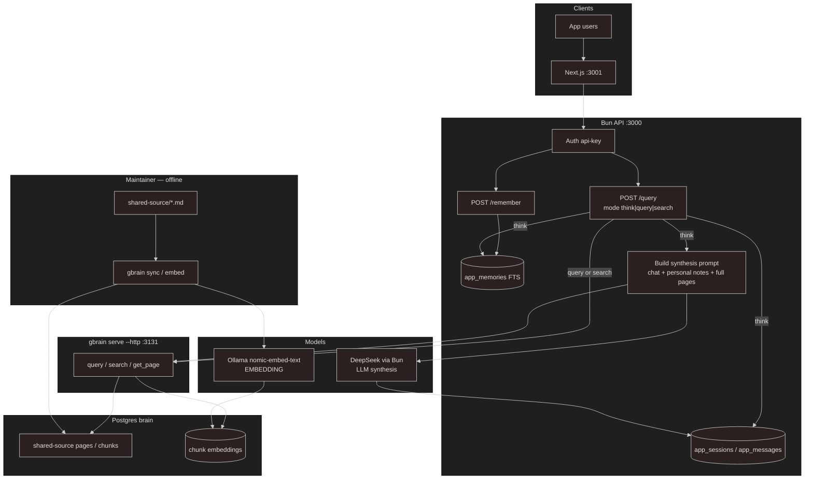
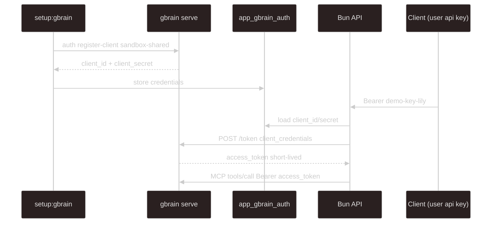

# gbrain-sandbox

Turborepo monorepo: Bun HTTP API (`apps/api`) with **shared knowledge in gbrain** and **personal memory in app Postgres**, plus a minimal Next.js UI (`apps/web`). No per-user git repos or per-user gbrain sources.

## Layout

```
gbrain-sandbox/
├── apps/
│   ├── api/                # Bun HTTP API (@gbrain-sandbox/api) :3000
│   └── web/                # Next.js UI (@gbrain-sandbox/web) :3001
├── packages/
│   └── typescript-config/  # Shared TSConfig
├── shared-source/          # Maintainer knowledge → one gbrain source (repo root)
├── docs/API.md             # Bun HTTP API contract
├── .env                    # gbrain + apps (see .env.example)
├── turbo.json
└── assets/                 # Images (optional)
```

Only `shared-source/` holds maintainer markdown for the shared gbrain source. It is a **normal subdirectory of this monorepo** (one git root — no nested `shared-source/.git`). Personal memory does **not** use git or gbrain sources. Keep `shared-source/` and `.env` at the **repo root** so project-scoped gbrain resolves them.

Requires **gbrain ≥ 0.42.62** (monorepo subdir sync / `--src-subpath`). On Windows, if `gbrain sync` errors with “resolves outside git repo”, the installed CLI still has a path-separator bug in the scope check — patch `sync.ts` to use `path.sep` instead of hardcoded `/` (until upstream fixes it).

## Architecture

| Layer            | Storage                 | Scope                         | Git?                  |
| ---------------- | ----------------------- | ----------------------------- | --------------------- |
| Shared knowledge | gbrain `shared-source`  | Everyone                      | Yes (maintainer sync) |
| Personal memory  | Postgres `app_memories` | Owner only (`user_id` filter) | No                    |
| Chat turns       | Postgres `app_messages` | Per user (Bun)                | No                    |



| Path                        | Embedding (Ollama)                                         | LLM (DeepSeek)                          |
| --------------------------- | ---------------------------------------------------------- | --------------------------------------- |
| Maintainer `sync` / `embed` | Yes — embed shared chunks into the brain                   | No                                      |
| `POST /query` `mode=think`  | Yes — hybrid `query` embeds the question                   | Yes — Bun synthesizes from full page(s) |
| `POST /query` `mode=query`  | Yes — hybrid retrieve only (API logs hit scores)           | No                                      |
| `POST /query` `mode=search` | No — keyword / BM25 only                                   | No                                      |
| `POST /remember`            | No — row in `app_memories` only                            | No                                      |
| Personal notes (think only) | No — Postgres FTS, then injected into the synthesis prompt | Indirect — LLM sees them in the prompt  |

**Think mode:** load chat history + this user's `app_memories` → gbrain `query` (hybrid) → score-based slug selection (`HYDRATE_*`) → `get_page` for each slug (full body) → Bun synthesizes with DeepSeek → store turn. Does **not** call gbrain MCP `think` (avoids ~600-char page clips).

**Query / search modes:** retrieval only; no chat write, no personal-memory injection, no LLM.

**Remember:** insert into `app_memories` for `user_id` only.

**New user:** insert `app_users` row → ready. No per-user `sources add`, git repo, or OAuth client.

At scale, user count grows **rows** in `app_memories`, not filesystem repos or gbrain sources. Isolation is a hard `user_id` filter. One app-level OAuth client calls gbrain `query` / `search` / `get_page` (read scope).

## Prerequisites

- Postgres (`GBRAIN_DATABASE_URL`)
- **gbrain ≥ 0.42.62**, `bun`, Ollama (`nomic-embed-text`), DeepSeek API key
- `gbrain serve --http` on port **3131**
- Required hydrate env vars (see `.env.example`) for think mode

## Gbrain: project vs global

gbrain can run **globally** (`~/.gbrain`) or **per project** (`.env` + sources in a repo). This sandbox is **project-scoped** — run `gbrain` commands, including `gbrain serve --http --port 3131`, from **this repo root** so `.env` and `./shared-source` resolve correctly.

## Setup

### 1. Install

```bash
bun install
```

Uses Bun workspaces + Turborepo. From the repo root:

| Script                 | What it runs                                |
| ---------------------- | ------------------------------------------- |
| `bun run dev:api`      | Bun API (`apps/api`) on `:3000`             |
| `bun run dev:web`      | Next.js UI (`apps/web`) on `:3001`          |
| `bun run setup:gbrain` | Register shared-source + OAuth + demo users |
| `bun run check-types`  | Typecheck workspace packages                |

### 2. Environment

Copy `.env.example` to `.env` and fill in values (keep `.env` at the **repo root**).

### 3. Shared source + OAuth (one-time)

```bash
bun run setup:gbrain
```

Registers `shared-source`, syncs it, creates **one** OAuth client (`sandbox-shared`, `read` on shared), stores it in `app_gbrain_auth`, and **upserts six seed users** into `app_users` (Lily, Haewon, Sullyoon, Bae, Jiwoo, Kyujin) while removing legacy `bob`. Re-runs skip existing OAuth unless you pass `-- --force-oauth`; users are always re-upserted.

#### How Bun authenticates to gbrain (MCP)

Two different “Bearer” tokens show up in this project — do not confuse them:

| Token                          | Who issues it              | Who uses it                                                       | Lifetime                                             |
| ------------------------------ | -------------------------- | ----------------------------------------------------------------- | ---------------------------------------------------- |
| Demo API key (`demo-key-<id>`) | This Bun app (`app_users`) | Browser / curl → Bun (`POST /query`, `/remember`, user mutations) | Permanent until you change the row                   |
| gbrain OAuth **access token**  | gbrain `/token`            | Bun → gbrain MCP (`/mcp`)                                         | Short-lived (cached in Bun memory until near expiry) |

Setup registers a long-lived **OAuth client** with gbrain. Equivalent CLI (run from the repo root; `setup:gbrain` does this for you):

```bash
gbrain auth register-client sandbox-shared \
  --grant-types client_credentials \
  --scopes read \
  --source shared-source \
  --federated-read shared-source
```

gbrain returns `client_id` + `client_secret`; Bun saves them in `app_gbrain_auth` (single row `id = 'default'`). Those credentials stay valid until you revoke/re-register (e.g. `--force-oauth`). They are **not** app user accounts and are **not** the Admin Token printed by `gbrain serve` (that is only for `http://localhost:3131/admin`).

At runtime, when the Bun API needs shared knowledge:

1. Load `oauth_client_id` / `oauth_client_secret` from `app_gbrain_auth`
2. `POST` to gbrain `/token` with `grant_type=client_credentials` and `scope=read`
3. Receive a temporary `access_token`
4. Call gbrain MCP (`/mcp`) with `Authorization: Bearer <access_token>` for tools such as `query`, `search`, and `get_page`



### 4. Start gbrain (terminal 1)

```bash
gbrain serve --http --port 3131
```

### 5. Start Bun API (terminal 2)

```bash
bun run dev:api
```

Listens on `http://localhost:3000` (override with `PORT`).

### 6. Start Next.js UI (terminal 3)

```bash
bun run dev:web
```

Opens at `http://localhost:3001`. The browser calls the Bun API (`NEXT_PUBLIC_API_URL` / `API_URL`, default `http://localhost:3000`). Override via `apps/web/.env.local`.

## Bun API (demo auth)

| Endpoint            | Auth                      | Body                                    |
| ------------------- | ------------------------- | --------------------------------------- |
| `GET /health`       | none                      | —                                       |
| `GET /users`        | none                      | —                                       |
| `POST /users`       | Bearer if any users exist | `{ "id": "...", "apiKey?" }`            |
| `GET /users/:id`    | none                      | —                                       |
| `PATCH /users/:id`  | Bearer                    | `{ "apiKey?" }` (omit to regenerate)    |
| `DELETE /users/:id` | Bearer                    | —                                       |
| `POST /query`       | Bearer                    | `{ "message": "...", "mode": "think" }` |
| `POST /remember`    | Bearer                    | `{ "content": "..." }`                  |

Seed users (after `bun run setup:gbrain`): `lily`, `haewon`, `sullyoon`, `bae`, `jiwoo`, `kyujin` with keys `demo-key-<id>`. `mode` is `think` (default), `query`, or `search`. Full contract: [`docs/API.md`](docs/API.md).

## Maintainer workflow (shared only)

Add or edit markdown under `shared-source/`, commit in **this** repo, then:

```bash
gbrain sync --source shared-source
gbrain embed --stale
```

gbrain walks up from `./shared-source` to the monorepo `.git` and imports only that subdirectory.

## Postgres tables (Bun)

| Table             | Purpose                                                                   |
| ----------------- | ------------------------------------------------------------------------- |
| `app_users`       | App users + API keys (seeded: lily, haewon, sullyoon, bae, jiwoo, kyujin) |
| `app_gbrain_auth` | Long-lived gbrain OAuth **client** id/secret (app → MCP; not per-user)    |
| `app_memories`    | Personal notes (`user_id` + `slug` + `content`)                           |
| `app_sessions`    | One active thread per user                                                |
| `app_messages`    | Chat history                                                              |

`app_gbrain_auth` columns: `id` (always `default`), `oauth_client_id`, `oauth_client_secret`, `updated_at`. gbrain does **not** read this table — it is Bun’s private copy of the client credentials issued at setup.
**`slug`:** short unique id for one memory note per user (e.g. `memory/note-1729123456789`). Auto-assigned on `POST /remember`; same slug for that user updates the row. Injected into the synthesis prompt as `[slug]` for reference.

```sql
SELECT id, api_key FROM app_users;
SELECT user_id, slug, left(content, 80) FROM app_memories ORDER BY created_at DESC LIMIT 10;
SELECT role, left(content, 80) FROM app_messages ORDER BY created_at DESC LIMIT 10;
```

## Test demo

Demo markdown under `shared-source/` is tracked in this repo. After editing pages, commit at the monorepo root, then:

```bash
gbrain sync --source shared-source
gbrain embed --stale
```

**Single-file checks** (`shared-source/test-demo`): protocol codename, vault passphrase, Chief Archivist, etc.

**Cross-file hydrate** — answer is split across three pages (slugs are git-root-relative):

| Slug                             | Fact                                    |
| -------------------------------- | --------------------------------------- |
| `shared-source/north-quay-relay` | callsign `ORION-LATCH` (Pier 7)         |
| `shared-source/duty-roster`      | color token `violet-green` (Mira Quill) |
| `shared-source/heptagon-watch`   | watch count `7`                         |

Ask in **think** mode: _What is the full arming formula for the North Quay Relay?_  
Expected: `ORION-LATCH/violet-green/7`. Bun API console logs every hybrid `query` hit (score, ratio vs top, factors) and marks hydrate-selected slugs.

Note: gbrain MCP `think` truncates gathered pages to ~600 characters ([#2369](https://github.com/garrytan/gbrain/issues/2369)). This sandbox’s **think** mode uses `query` + `get_page` + Bun DeepSeek instead.

## Env vars

| Variable                      | Purpose                                                                  |
| ----------------------------- | ------------------------------------------------------------------------ |
| `GBRAIN_DATABASE_URL`         | gbrain + default app DB                                                  |
| `APP_DATABASE_URL`            | Bun tables (optional; falls back to `GBRAIN_DATABASE_URL`)               |
| `DEEPSEEK_API_KEY`            | Bun think-mode synthesis (required for `mode=think`)                     |
| `GBRAIN_CHAT_MODEL`           | Default synthesis model id (e.g. `deepseek:deepseek-v4-flash`)           |
| `SYNTHESIS_MODEL`             | Optional override; DeepSeek model id without `deepseek:` prefix          |
| `HYDRATE_SCORE_RATIO`         | **Required** — min score vs top hit to include a page (e.g. `0.65`)      |
| `HYDRATE_MAX_PAGES`           | **Required** — max pages to load per think request (e.g. `5`)            |
| `HYDRATE_MAX_CHARS_PER_PAGE`  | **Required** — max chars per hydrated page (e.g. `8000`)                 |
| `HYDRATE_MAX_TOTAL_CHARS`     | **Required** — max total hydrated chars per think request (e.g. `24000`) |
| `GBRAIN_EMBEDDING_MODEL`      | e.g. `ollama:nomic-embed-text`                                           |
| `GBRAIN_EMBEDDING_DIMENSIONS` | e.g. `768`                                                               |
| `GBRAIN_MCP_BASE_URL`         | Default `http://localhost:3131`                                          |
| `PORT`                        | Bun API port (default `3000`)                                            |
| `API_URL` / `NEXT_PUBLIC_API_URL` | Next.js → Bun base URL (default `http://localhost:3000`) |

## gbrain CLI (direct)

```bash
gbrain sources list
gbrain sync --source shared-source
gbrain embed --stale
gbrain doctor
```

## Out of scope for this demo

- Real user login / signup API (JWT); demo uses hardcoded API keys
- Vector embeddings for personal memory (Postgres FTS + recent fallback)
- Multiple sessions per user
- Rate limits / quotas on think-mode synthesis
- TLS / production deployment
- Using gbrain MCP `think` for answers (sandbox synthesizes in Bun instead)
