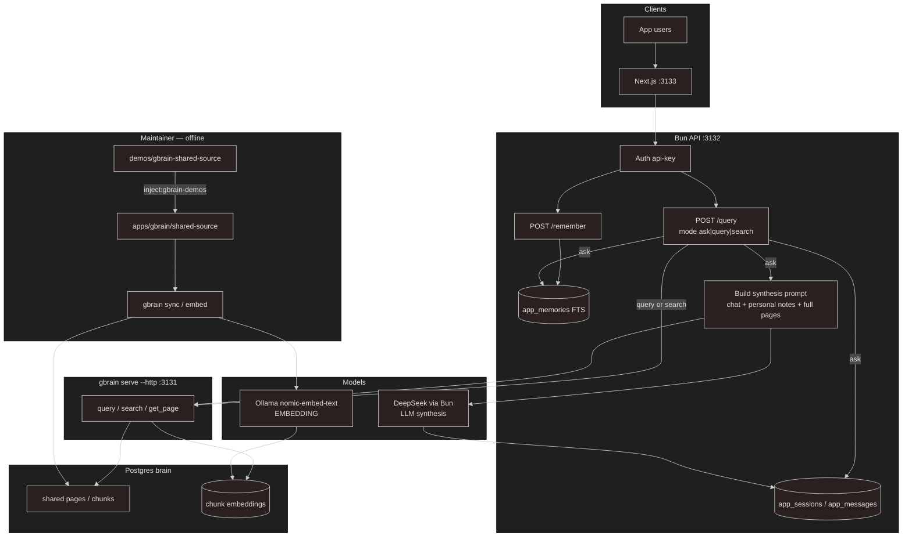
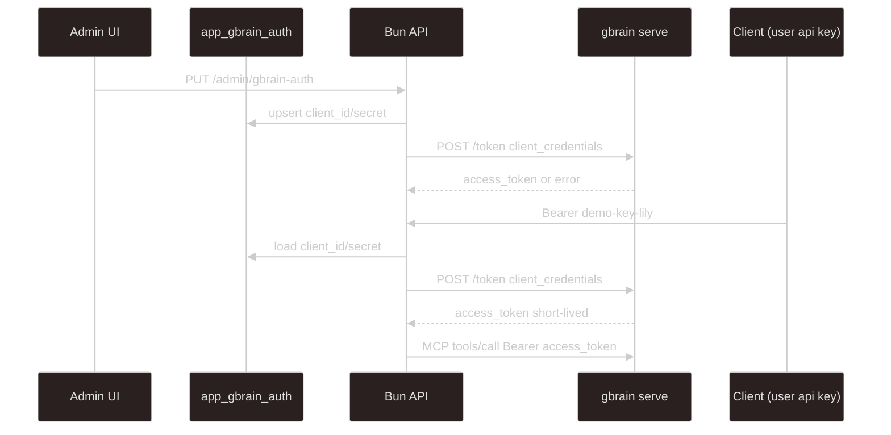

# gbrain-sandbox

Turborepo monorepo: Bun HTTP API (`apps/api`) with **shared knowledge in gbrain** and **personal memory in app Postgres**, plus a minimal Next.js UI (`apps/web`).

**gbrain admin** (nested git checkout, pgvector, sync, serve, OAuth): see [`docs/GBRAIN_SETUP.md`](docs/GBRAIN_SETUP.md). This file covers the monorepo and the Bun/web apps.

## Layout

```
gbrain-sandbox/
├── apps/
│   ├── api/                 # Bun HTTP API (@gbrain-sandbox/api) :3132
│   ├── web/                 # Next.js UI (@gbrain-sandbox/web) :3133
│   └── gbrain/              # Nested gbrain git repo (ignored) — see docs/GBRAIN_SETUP.md
├── demos/
│   └── gbrain-shared-source/  # Demo markdown templates (inject into apps/gbrain)
├── packages/
│   └── typescript-config/
├── scripts/
│   ├── inject-gbrain-demos.ts
│   └── run-gbrain.ts
├── docs/
│   ├── API.md
│   └── GBRAIN_SETUP.md
├── .env                     # Bun API only (see .env.example)
├── turbo.json
└── assets/
```

## Architecture

| Layer            | Storage                 | Scope                         | Git?                                      |
| ---------------- | ----------------------- | ----------------------------- | ----------------------------------------- |
| Shared knowledge | gbrain (`apps/gbrain`)  | Everyone                      | Yes — **nested** repo under `apps/gbrain` |
| Personal memory  | Postgres `app_memories` | Owner only (`user_id` filter) | No                                        |
| Chat turns       | Postgres `app_messages` | Per user (Bun)                | No                                        |



| Path                        | Embedding (Ollama)                                         | LLM (DeepSeek)                          |
| --------------------------- | ---------------------------------------------------------- | --------------------------------------- |
| Maintainer `sync` / `embed` | Yes — embed shared chunks into the brain                   | No                                      |
| `POST /query` `mode=ask`    | Yes — hybrid `query` embeds the question                   | Yes — Bun synthesizes from full page(s) |
| `POST /query` `mode=query`  | Yes — hybrid retrieve only (API logs hit scores)           | No                                      |
| `POST /query` `mode=search` | No — keyword / BM25 only                                   | No                                      |
| `POST /remember`            | No — row in `app_memories` only                            | No                                      |
| Personal notes (ask only)   | No — Postgres FTS, then injected into the synthesis prompt | Indirect — LLM sees them in the prompt  |

**Ask mode:** load chat history and this user's `app_memories` (Postgres FTS) in Bun; call gbrain `query` with the question only → hydrate (`HYDRATE_*`) → `get_page` → merge history + personal notes + full pages into a Bun DeepSeek prompt → store turn.

**gbrain MCP `think` is not used** in this architecture. Its gather path truncates page bodies (about **600 characters** per page), which drops too much context for ask answers. Synthesis always runs in Bun (DeepSeek) after `query` + `get_page` so full page text can be hydrated under `HYDRATE_*`.

**Query / search:** retrieval only. **Remember:** `app_memories` for `user_id` only. One shared OAuth client (stored in `app_gbrain_auth`) calls gbrain over HTTP — setup in [`docs/GBRAIN_SETUP.md`](docs/GBRAIN_SETUP.md); paste credentials on `/gbrain-connection`.

## Prerequisites

- Two Postgres databases: knowledge (`gbrain`) and app (`gbrain_app`) — see [`docs/GBRAIN_SETUP.md`](docs/GBRAIN_SETUP.md) for pgvector on the knowledge DB
- `bun`, DeepSeek API key, hydrate env (root `.env.example`)
- gbrain CLI + Ollama for sync/embed ([`docs/GBRAIN_SETUP.md`](docs/GBRAIN_SETUP.md))

## Setup (apps)

### 1. Install

```bash
bun install
```

| Script                        | What it runs                                    |
| ----------------------------- | ----------------------------------------------- |
| `bun run dev`                 | Turbo: API + web together                       |
| `bun run dev:api`             | Bun API (`apps/api`) on `:3132`                 |
| `bun run dev:web`             | Next.js UI (`apps/web`) on `:3133`              |
| `bun run seed`                | Upsert demo users into `app_users`              |
| `bun run check-types`         | Typecheck workspace packages                    |
| `bun run inject:gbrain-demos` | Copy `demos/gbrain-shared-source` → nested repo |
| `bun run gbrain:serve`        | `gbrain serve --http` in `apps/gbrain`          |
| `bun run gbrain:sync`         | Full sync in `apps/gbrain`                      |
| `bun run gbrain:embed`        | `gbrain embed --stale` in `apps/gbrain`         |

Full gbrain greenfield (clone nested repo, `.env`, migrations, OAuth): [`docs/GBRAIN_SETUP.md`](docs/GBRAIN_SETUP.md).

### 2. Environment (API)

Copy root `.env.example` → `.env` (`APP_DATABASE_URL`, DeepSeek, `HYDRATE_*`, `GBRAIN_MCP_BASE_URL`).

Configure gbrain separately: [`docs/GBRAIN_SETUP.md`](docs/GBRAIN_SETUP.md).

### 3. Greenfield order

1. Finish **gbrain** setup per [`docs/GBRAIN_SETUP.md`](docs/GBRAIN_SETUP.md) (nested clone, inject demos, sync, serve, register OAuth).
2. **App DB** — Prisma migrate, then seed:

```bash
cd apps/api
bun run prisma -- migrate dev --name init
cd ../..
bun run seed
```

3. Start `bun run gbrain:serve`, then `bun run dev:api` and `bun run dev:web`.
4. Open `/auth` → **Connect to gbrain** and paste the OAuth client id/secret.

### How Bun authenticates to gbrain (runtime)

| Token                          | Who issues it              | Who uses it               |
| ------------------------------ | -------------------------- | ------------------------- |
| Demo API key (`demo-key-<id>`) | This Bun app (`app_users`) | Browser / curl → Bun      |
| gbrain OAuth **access token**  | gbrain `/token`            | Bun → gbrain MCP (`/mcp`) |

At runtime Bun loads `app_gbrain_auth`, exchanges client credentials for an access token, then calls MCP tools (`query`, `search`, `get_page`). Register the OAuth client under gbrain; paste credentials on `/gbrain-connection`.



## Bun API (demo auth)

| Endpoint                               | Auth                      | Body                                      |
| -------------------------------------- | ------------------------- | ----------------------------------------- |
| `GET /health`                          | none                      | —                                         |
| `GET /users`                           | none                      | —                                         |
| `POST /users`                          | Bearer if any users exist | `{ "id": "...", "apiKey?" }`              |
| `GET /users/:id`                       | none                      | —                                         |
| `PATCH /users/:id`                     | Bearer                    | `{ "apiKey?" }` (omit to regenerate)      |
| `DELETE /users/:id`                    | Bearer                    | —                                         |
| `GET /users/:id/data`                  | Bearer                    | Query: `messagePage`                      |
| `DELETE /users/:id/memories/:memoryId` | Bearer                    | —                                         |
| `GET /sessions`, `POST /sessions`      | Bearer                    | —                                         |
| `PATCH /sessions/:id`                  | Bearer                    | `{ "title": "..." \| null }`              |
| `POST /query`                          | Bearer                    | `{ "message", "mode?", "sessionId?" }`    |
| `POST /remember`                       | Bearer                    | `{ "content": "..." }`                    |
| `POST /admin/nuke`                     | none                      | `{ "target": "app" }` — app DB only       |
| `GET/PUT/DELETE /admin/gbrain-auth`    | none                      | OAuth client credentials for Bun → gbrain |
| `POST /admin/gbrain-auth/test`         | none                      | Token exchange smoke test                 |

Seed users (after `bun run seed`): `lily`, `haewon`, `sullyoon`, `bae`, `jiwoo`, `kyujin` with keys `demo-key-<id>`. Full contract: [`docs/API.md`](docs/API.md).

Demo knowledge Q&A (after gbrain sync): see [`docs/GBRAIN_SETUP.md`](docs/GBRAIN_SETUP.md#demo-pages).

## Web UI routes

| Path                        | Purpose                                |
| --------------------------- | -------------------------------------- |
| `/`                         | Redirects to `/ask`                    |
| `/ask`, `/query`, `/search` | Query modes (shared shell + mode tabs) |
| `/auth`                     | Sign in / switch account               |
| `/settings/:userId`         | Account settings for that user id      |
| `/gbrain-connection`        | Paste gbrain OAuth client id/secret    |

## Postgres tables (Bun / `APP_DATABASE_URL`)

| Table             | Purpose                                                                   |
| ----------------- | ------------------------------------------------------------------------- |
| `app_users`       | App users + API keys (seeded: lily, haewon, sullyoon, bae, jiwoo, kyujin) |
| `app_gbrain_auth` | Long-lived gbrain OAuth **client** id/secret (app → MCP; not per-user)    |
| `app_memories`    | Personal notes (`user_id` + `slug` + `content`)                           |
| `app_sessions`    | Chat threads per user (optional `title`; ask mode; selectable in the UI)  |
| `app_messages`    | Chat history                                                              |

**`slug`:** short unique id for one memory note per user. Auto-assigned on `POST /remember`.

```sql
SELECT id, api_key FROM app_users;
SELECT user_id, slug, left(content, 80) FROM app_memories ORDER BY created_at DESC LIMIT 10;
SELECT role, left(content, 80) FROM app_messages ORDER BY created_at DESC LIMIT 10;
```

## Env vars (repo root `.env` — Bun API)

| Variable                          | Purpose                                                                  |
| --------------------------------- | ------------------------------------------------------------------------ |
| `APP_DATABASE_URL`                | Bun/Prisma app DB (required; e.g. `…/gbrain_app`)                        |
| `DEEPSEEK_API_KEY`                | Bun ask-mode synthesis (required for `mode=ask`)                         |
| `GBRAIN_CHAT_MODEL`               | Synthesis model id (e.g. `deepseek:deepseek-v4-flash` in `.env.example`) |
| `SYNTHESIS_MODEL`                 | Optional override (DeepSeek id without `deepseek:` prefix)               |
| `DEEPSEEK_API_BASE_URL`           | Optional; default `https://api.deepseek.com`                             |
| `HYDRATE_SCORE_RATIO`             | **Required** — min score vs top hit to include a page (e.g. `0.65`)      |
| `HYDRATE_MAX_PAGES`               | **Required** — max pages to load per ask request (e.g. `5`)              |
| `HYDRATE_MAX_CHARS_PER_PAGE`      | **Required** — max chars per hydrated page (e.g. `8000`)                 |
| `HYDRATE_MAX_TOTAL_CHARS`         | **Required** — max total hydrated chars per ask request (e.g. `24000`)   |
| `GBRAIN_MCP_BASE_URL`             | gbrain HTTP base (default `http://localhost:3131`)                       |
| `GBRAIN_MCP_URL`                  | Optional full MCP endpoint (default `{GBRAIN_MCP_BASE_URL}/mcp`)         |
| `GBRAIN_OAUTH_TOKEN_URL`          | Optional token URL (default `{GBRAIN_MCP_BASE_URL}/token`)               |
| `PORT`                            | Bun API port (default `3132`)                                            |
| `API_URL` / `NEXT_PUBLIC_API_URL` | Next.js → Bun base URL (default `http://localhost:3132`)                 |

If both `SYNTHESIS_MODEL` and `GBRAIN_CHAT_MODEL` are unset, Bun falls back to `deepseek-chat`.

gbrain-only variables: template in [`docs/GBRAIN_SETUP.md`](docs/GBRAIN_SETUP.md#environment-appsgbrainenv).

## Out of scope for this demo

- Real user login / signup API (JWT); demo uses hardcoded API keys
- Vector embeddings for personal memory (Postgres FTS + recent fallback)
- Rate limits / quotas on ask-mode synthesis
- TLS / production deployment
- Calling gbrain MCP `think` (intentionally unused; see architecture note above)
